# RECOMBINANT INGEST PIPELINE (USING NIFI + ELK)
Objective: Develop highly modular, reconfigurable document ingest pipelines that accelerate prototype and development of extraction and triage capabilities.

## QUICKSTART GUIDE 

This section will allow a user to run the entire pipeline, once they have successfully installed and set up their environments per the NIFI INSTALLATION and ELK INSTALLATION guides. If a user needs to access the pipeline on a "run and go" basis, this QUICKSTART GUIDE is how a user will do so.

#### ACCESS NIFI

1. Access the nifi-1.14.0-bin.zip folder on your machine. Navigate to the bin folder. Within this folder, run the file titled "run-nifi". You may be presented with a security warning, this is okay - run the file. Also, a command prompt window housing text will likely present itself, this is also okay - minimize and ignore this screen.

2. Copy and paste this link https://localhost:8443/nifi/ into the URL section of your preferred web browser. If you are shown a "Your connection is not private" or akin message due to the lack of the webpage being HTTPS, this is expected - access the webpage anyways.

3. After waiting for your NIFI instance to boot, you will be asked to log in with your credentials. Enter your saved username and password and press "Log In".

4. Once you are successfully logged into NIFI, you now have full access to the platform.

#### ACCESS ELK

1. In Docker Desktop:

    A. Open Docker Desktop, navigate to the containers/apps section, and press “start” on the “docker security tweaks” container. 
    
    B. Once it is running, you can access elasticsearch by pasting the URL http://localhost:5601 into your web browser.
  
2. In Command Line:
    
    A. Navigate to the "docker-compose.yml" file inside of the "docker-elk-security-tweaks" folder.

    B. Right-click in the folder and click "Open in Windows Terminal".
    
    C. Use the "docker compose up" command in your terminal to start an instance of ELK stack.
    ```
    docker compose up
    ```    
    D. Once it is running, you can access elasticsearch by pasting the URL http://localhost:5601 into your web browser.

## TABLE OF CONTENTS

1. [NIFI Installation](#nifi_installation)

    A. [Install NIFI](#install_nifi)
    
    B. [Install Prerequisite NAR File](#install_prerequisite_nar_file)
    
    C. [Start NIFI](#start_nifi)
    
    D. [Username and Password](#username_and_password)
    
    E. [Install Template](#install_template)
    
    F. [Set Up Data to Ingest](#set_up_data_to_ingest)
    
    G. [Run The Template](#run_the_template)
    
    H. [NIFI User Guide](#nifi_user_guide)
    

2. [ELK Stack Installation](#elk_stack_installation)

    A. [Notes](#notes)
    
    B. [Download ELK Stack](#download_elk_stack)
    
    C. [Run Instance Of ELK Stack](#run_instance_of_elk_stack)
    
    D. [Access ELK Stack](#access_elk_stack)
    
    E. [Setup Instance Of ELK Stack](#setup_instance_of_elk_stack)
    
    F. [View Data In Kibana](#view_data_in_kibana)

<a name="nifi_installation"></a>
## NIFI INSTALLATION

<a name="install_nifi"></a>
#### INSTALL NIFI 

1. Before beginning, make sure your device has JAVA 8 installed and operational

    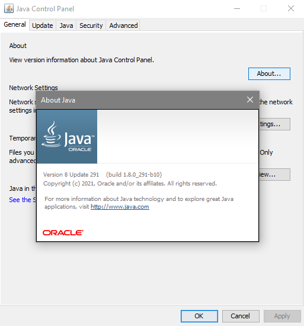
    
2. Go to the official website https://nifi.apache.org/download.html and navigate from releases > 1.14.0 > binaries > nifi-1.14.0-bin.zip file and begin downloading. Our platform was created with the version 1.14.0 release.

    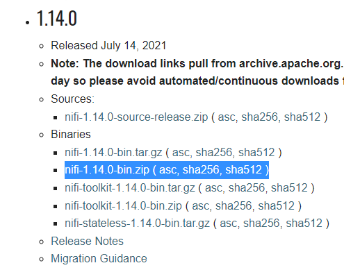
    
3. Unzip and extract the contents and this is how the folder structure will be in your system file explorer tool. The folder should contain bin, conf, docs, extensions, lib, license, notice, and readme.

    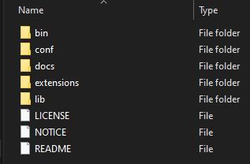

<a name="install_prerequisite_nar_file"></a>
#### INSTALL PREREQUISITE NAR FILE

1. After you have installed NiFi, you have one more task - and that is to install our prerequisite processor. To do this, download the “nifi-extracttext-nar-1.5.nar” file from our repository onto your system.

    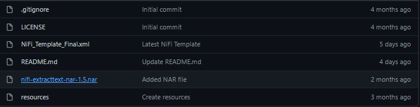

2. Once downloaded, navigate to the nifi-1.14.0 folder you extracted the content of earlier when it was a .zip file. Once inside this folder, go to the “lib” folder (short for library). This folder houses NiFi’s NAR files which are used to create processors within the app. 

    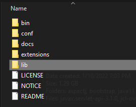

3. Once inside the nifi-1.14.0 -> lib folder, move the nar file you downloaded here. You may have to restart your computer to allow NiFi to update and register the processor.

    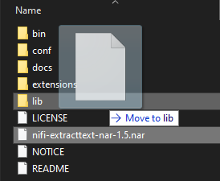

<a name="start_nifi"></a>
#### START NIFI 

1. To start NiFi, you can directly double-click on the “run-nifi.bat” file in the nifi-1.14.0 -> bin folder. 

    

2. If the command line produces a process ID, then your NiFi instance is running.

    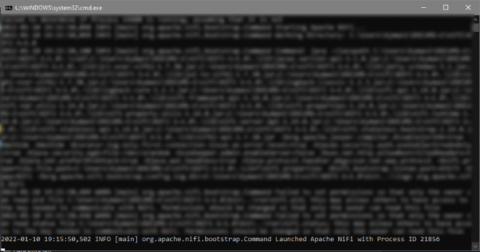

3. Go to the following URL – https://localhost:8443/nifi/ to check if NiFi has started. Don’t worry if this URL is not loading instantly. NiFi takes time after starting, just check periodically every few minutes.

    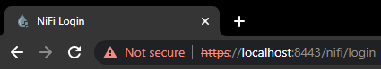
    
    The picture above shows the URL in Google Chrome.

4. If you see a warning message stating that “Your connection is not private” in the URL, click on “Advanced” and then click on “Proceed to localhost(unsafe)”. This message might appear due to the lack of the webpage being HTTPS, this is expected - access the webpage anyways.

<a name="username_and_password"></a>
#### USERNAME AND PASSWORD 

1. You should now be approached by a login page asking for your username and password. This information can be found within the “nifi-app.log” file in the nifi-1.14.0 -> logs folder.

    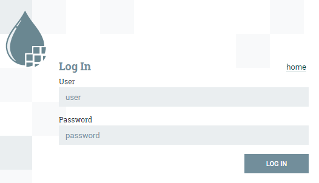

2. Open the “nifi-app.log” file and use Ctrl+F to search for the keywords “username” or “password”. Once you have these credentials, go to the URL where NiFi is running and log in.

    

3. Save your username and password in a secure place so you have convenient access to them.

<a name="install_template"></a>
#### INSTALL TEMPLATE

1. Once you are logged into the NiFi page, you should see a blank canvas. If not, this is okay. Holding down the shift key, use the mouse to select the canvas you see. Then, once the canvas is selected, right-click your mouse while the cursor is on the template and press “delete”. Make sure your canvas is clear before proceeding.

    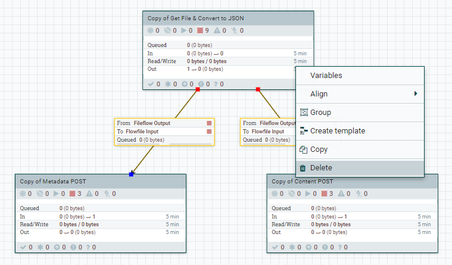

2. From our tika-document-ingest page, use the "NiFi_Template_Final.xml" file. You need to download the repo zip and extract the nifi template to access it. 

3. Navigate back to the NiFi page and right-click an empty space on the canvas. In the dropdown, click “Upload Template” and then click “Select Template” on the popup screen. Choose the "NiFi_Template_Final.xml" file you have downloaded and click "Upload".

    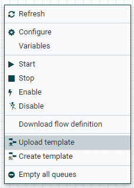 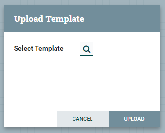

4. Once the template is successfully imported, you can drag the "Template" button at the top bar into the blank canvas and let go. This will show a popup screen where you can choose a template. Select the "NiFi Template Final" template and click "Add". 

    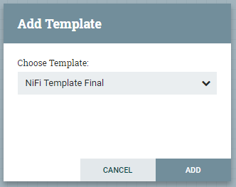

<a name="set_up_data_to_ingest"></a>
#### SET UP DATA TO INGEST 

1. In order to run the template, you will first need to create a new folder on your computer containing the various files you would like NIFI to ingest. An example of this is the folder called “nifi input” I created on my system. This folder can contain any file type, just make sure it has all of the files that you would like NIFI to take in. Also, it is important to note that any files in this folder **WILL BE DELETED** when Nifi is run. The location of this folder on my system is “C:\Users\Kymani\Documents\nifi input”. 

How to keep files and not have NIFI delete them on run?: In NIFI, double click the "Get File & Convert to JSON" processor group, then double click the "Get File" processor, navigate to properties, on the "keep source file" field - select true. Then click apply.

   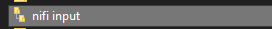

2. After you have created a folder on your system, put in [these](https://drive.google.com/file/d/1KCQ6QG7xePpCYB5dcV6sUBu-V2jVrVRv/view?usp=sharing) test files for NIFI to ingest. Then go back to the NIFI app on your browser.

    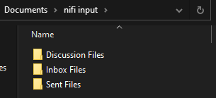

3. Once in the NIFI app, double click the processor group called “Get File & Convert to JSON” to open it. Once here, double-click the “GetFile” processor. After this, navigate to the “properties” tab.

    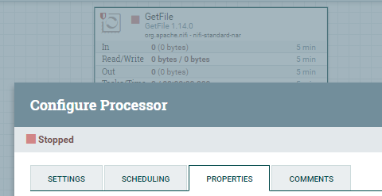

4. From here, you should see a property titled “Input Directory”. In the space next to it labeled “Value”, simply paste the EXACT file path of the folder containing your files you would like NIFI to ingest, with an example file path being “C:\Users\Kymani\Documents\nifi input” and press OK to close the processor. Then press "Apply" to save the the file path.

    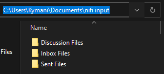 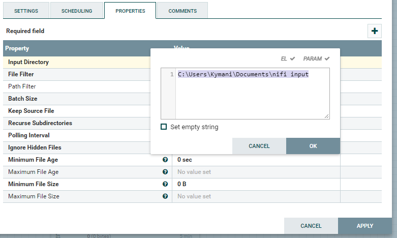

<a name="run_the_template"></a>
#### RUN THE TEMPLATE 

**Note: Make sure that you have a backup of the files in your input folder. Each NiFi run *WILL DELETE ALL FILES* in the input folder you created.**

1. Now you are all set! Now, to run NIFI and all of the processor groups. If you would like to run NiFi and all of its processors we have created, look at the bottom left of your NIFI app inside of the static solid white/gray colored bar. Make sure you are on the NIFI FLOW page and not inside of any of the processor groups. An easy way to confirm this is to look at your canvas, you should see all three processor groups, if you do then proceed. If you do not, simply press the NiFi FLOW text at the bottom of the screen and you will be navigated to the main page showing all of the processors. 

    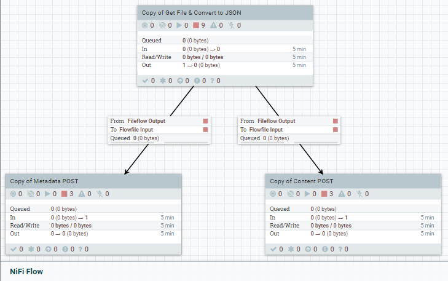

2. After confirming you are on the main page showing all three processor groups, simply right-click your mouse on a blank space of the canvas and press “Start” and NIFI will begin running the processes. In order for the pipeline to run correctly, make sure you have ELASTICSEARCH accessible and DOCKER running. 
Note: To watch your files populate in real time, right click on the canvas and press "Refresh".
    
   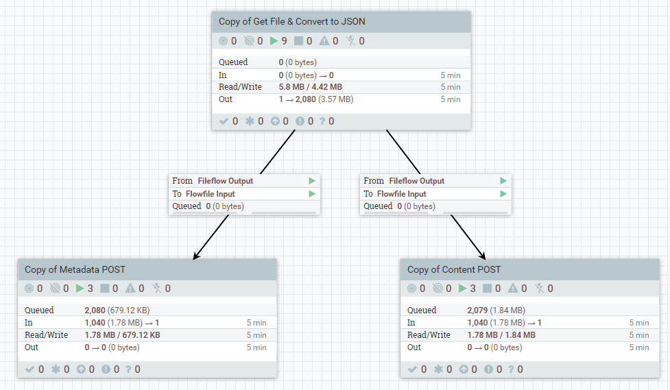

The input folder for this run (screenshot) contained 1,040 files.

<a name="nifi_user_guide"></a>
#### NIFI USER-GUIDE

1. Please refer to this link https://nifi.apache.org/docs/nifi-docs/html/user-guide.html to discover the various ways you can use nifi.

<a name="elk_stack_installation"></a>
## ELK INSTALLATION

<a name="notes"></a>
#### NOTES

1. "ELK" stands for ElasticSearch, LogStash, and Kibana / ElatisSearch = Data Store | LogStash = ? | Kibana = Data Visualization
2. Prerequisites for properly utilizing this stack is having Docker Desktop up and running on your system. Once you use the “docker compose up” command from your cmd prompt, the Docker Dekstop application will populate itself with the security tweaks files.

<a name="download_elk_stack"></a>
#### DOWNLOAD ELK STACK

1. Download the "security-tweaks" branch of this docker-ELK fork: https://github.com/UMD-ARLIS/docker-elk 

    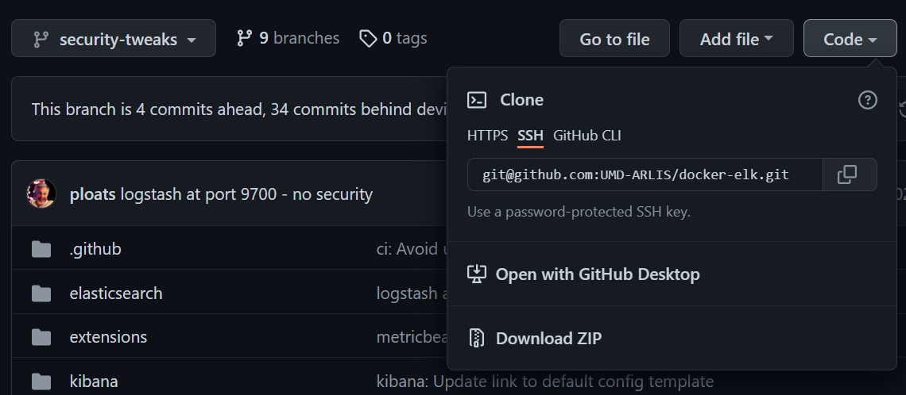
    
2. Extract the "docker-elk-security-tweaks" folder 

    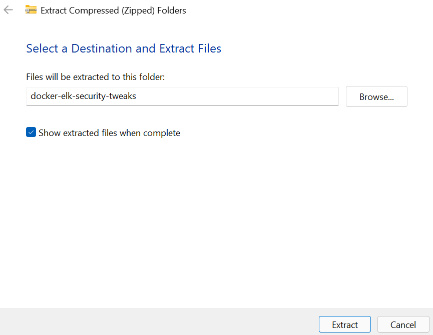

<a name="run_instance_of_elk_stack"></a>
#### RUN INSTANCE OF ELK STACK

1. Navigate to the "docker-compose.yml" file inside of the extracted folder

    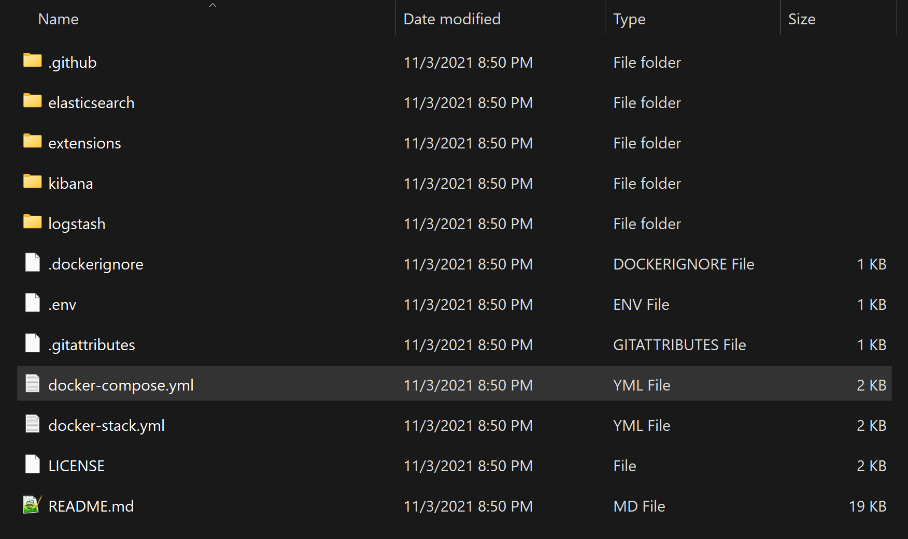

2. Right-click in the folder and click "Open in Windows Terminal"

    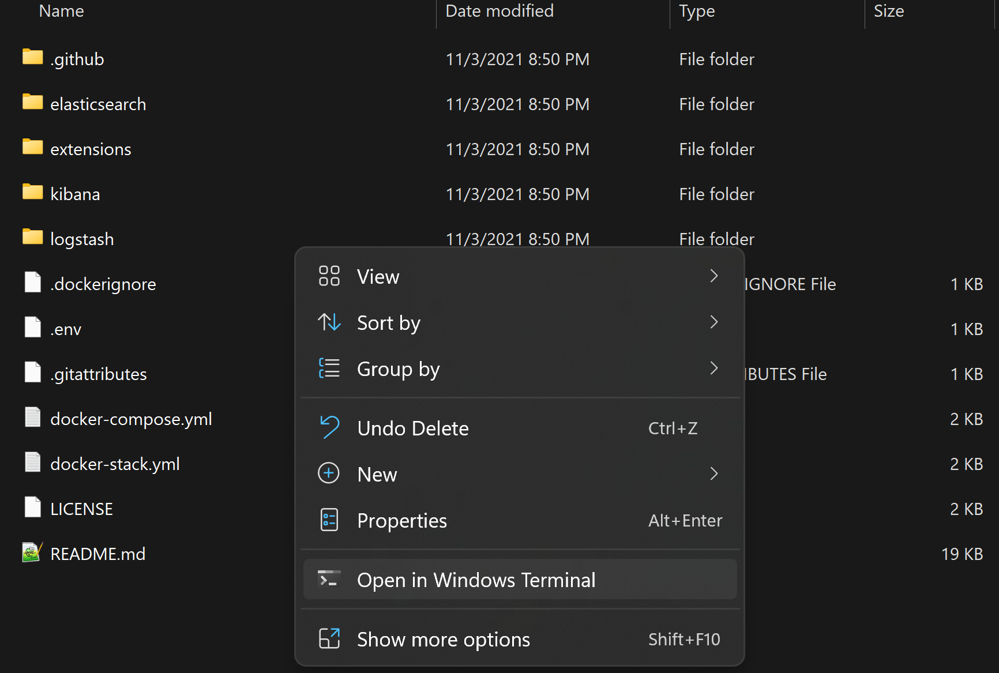

3. Use the "docker compose up" command in your terminal to start an instance of ELK stack
```
docker compose up
```
<a name="access_elk_stack"></a>
#### ACCESS ELK STACK

1. Once ELK stack is running successfully, run the workflow in Nifi which will send the data to ElasticSearch.
2. Access ELK stack through a browser (Microsoft Edge works well) using http://localhost:5601 and click on the three horizontal lines at the top left

    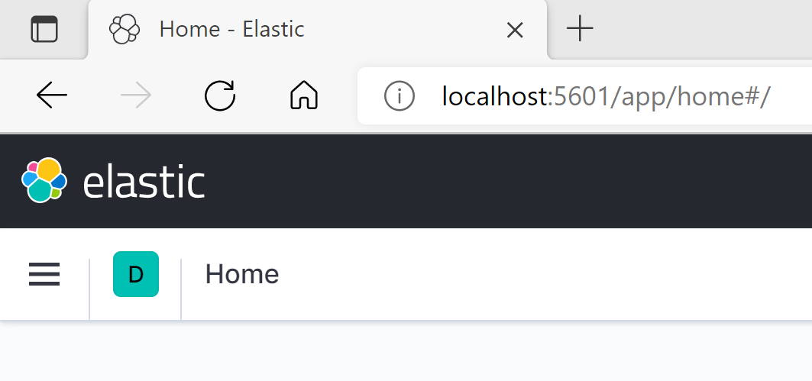

<a name="setup_instance_of_elk_stack"></a>
#### SETUP INSTANCE OF ELK STACK

1. Once inside ELK stack, scroll down to the "Management" section and click on "Stack Management"

    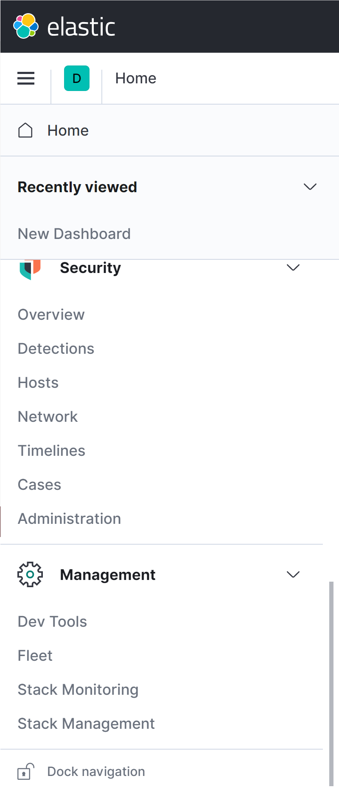

2. Near the left edge of the page, click on "Index Patterns" under "Kibana"

    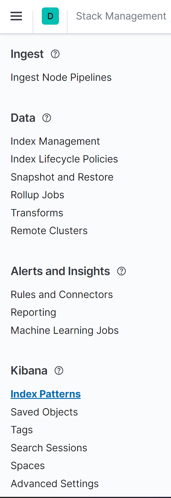

3. Click on the blue "Create index pattern" button

    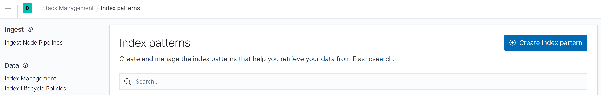

4. Type "tikac*" into the box for "Index pattern name" and click "Next step"

    

5. Click "file.lastAccessTime" for the "Time field" box and click "Create index pattern"

    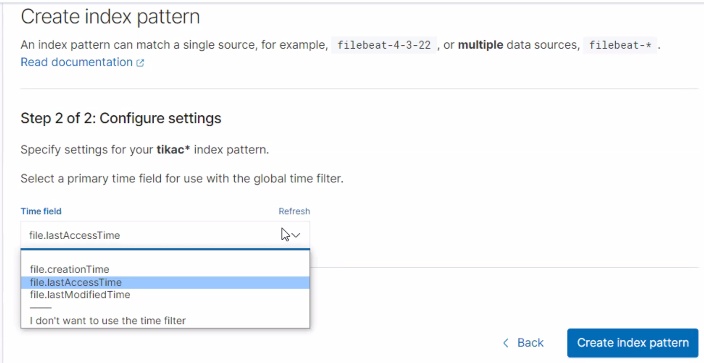

6. Repeat steps 8 to 11, using "tikam*" for the "Index pattern name" box in step 10

    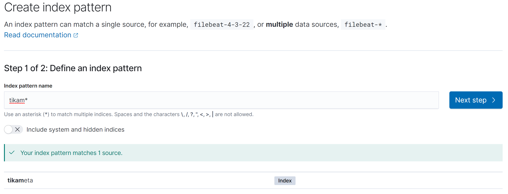

<a name="view_data_in_kibana"></a>
#### VIEW DATA IN KIBANA

1. Click on the three horizontal lines at the top left and click on "Discover" under the "Analytics" section

    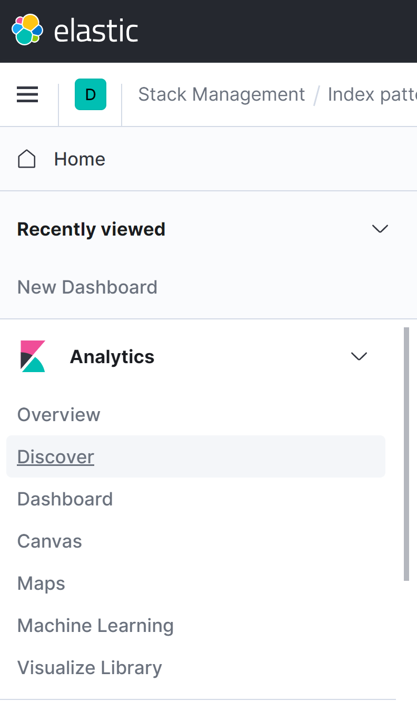

2. Change between the index patterns "tikac*" and "tikam*" by clicking on the index pattern dropdown above the field names near the left edge

    

3. View the data within a specific range of time by filtering the time at the top right or by clicking on the green bars of data

    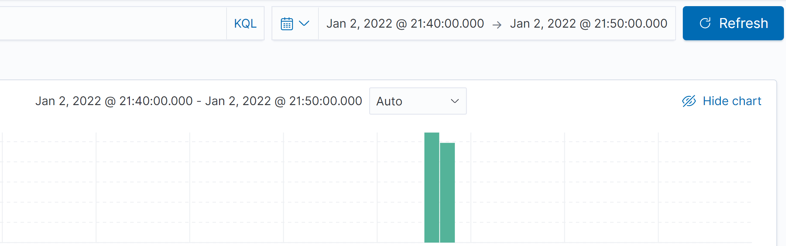
